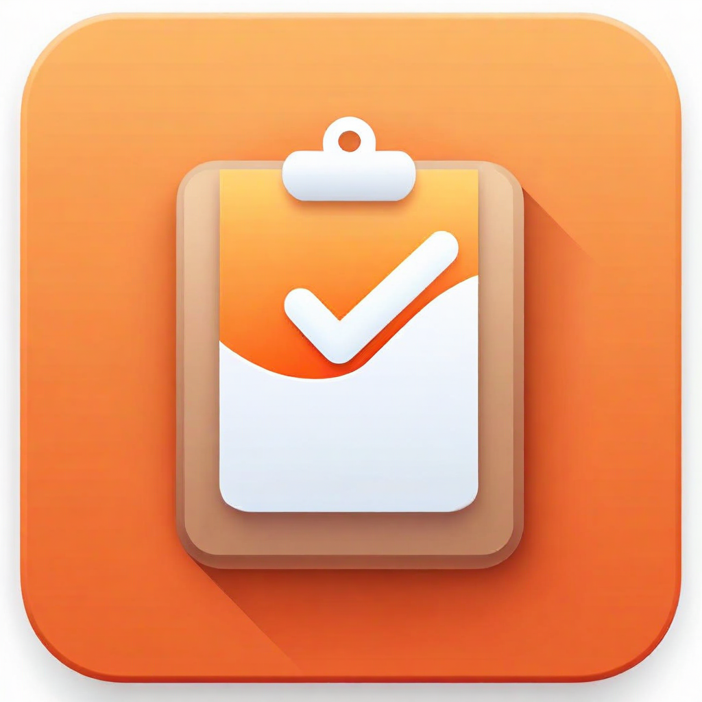
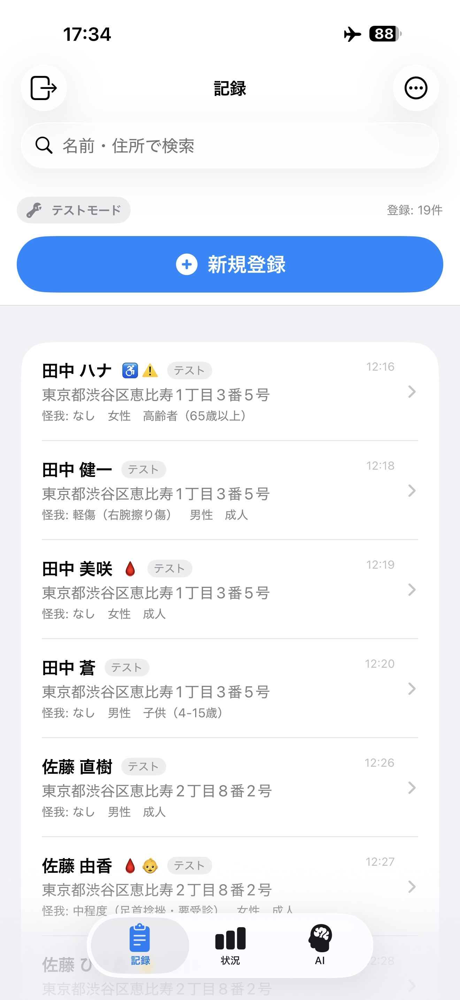
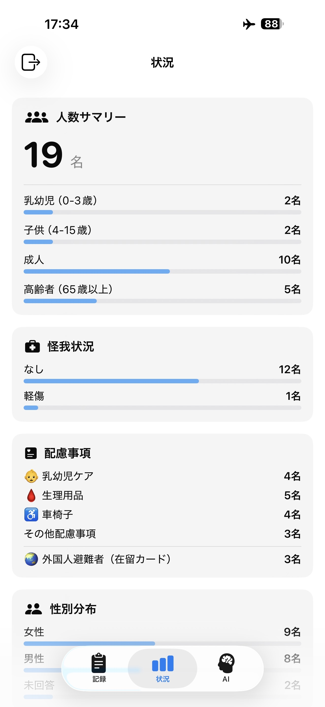
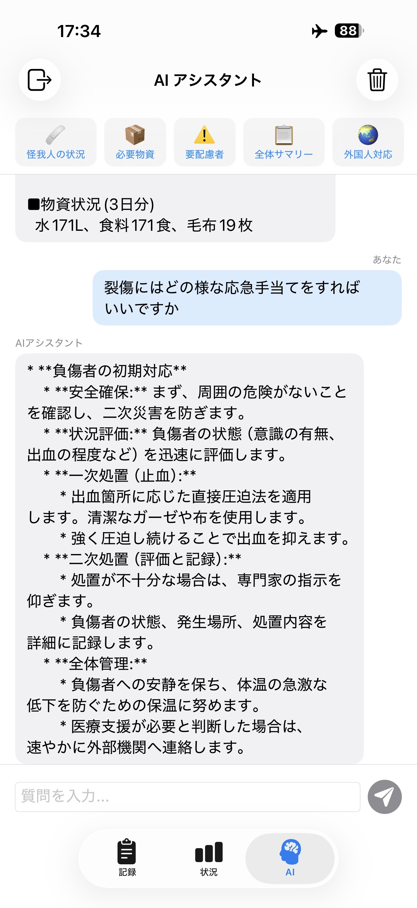

# ShelterAI — Fully Offline Shelter Management Powered by Gemma 4

**[🇯🇵 日本語版 README](README.ja.md)**

<p align="center">
  
</p>

<p align="center">
  
</p>

[](https://developer.apple.com/ios/)
[](https://swift.org)
[](LICENSE)
[](https://huggingface.co/mlboydaisuke/gemma-4-E2B-coreml)
[](https://www.kaggle.com/competitions/gemma-4-good-hackathon)

> **Not a replacement for paper — another option alongside it.**

### 🎬 [Demo Video](https://youtu.be/Cx2k1hUeT0o)

<p align="center">
  
  
  
</p>

ShelterAI is a fully offline iPhone app that turns an everyday device into a disaster shelter registration tool. Point the camera at any Japanese ID card; Gemma 4 E2B, running entirely on-device, extracts the evacuee's information in seconds. No internet, no subscriptions, no proprietary hardware.

**Tracks:** Main | Global Resilience | Cactus (Local-First Mobile)

---

## Features (30 features, 6,326 lines of code)

### 📸 Registration & Card Scanning
- **Auto-shutter camera** — Real-time card detection via VNDetectRectanglesRequest; auto-captures after 1.4s of stable detection
- **Gemma 4 multimodal analysis** — Image + prompt → structured JSON (name, address, DOB, card type)
- **Vision OCR fallback** — Apple Vision as cross-check; confidence-gated hybrid merge
- **Perspective correction** — CIPerspectiveCorrection + contrast boost for dim gymnasium lighting
- **5 card types** — My Number Card, driver's license, passport (MRZ), residence card, health insurance card
- **Manual input** — 15-region injury body-part picker, special-needs toggles, gender/age pickers
- **Family group inference** — Same surname + address block → automatic grouping suggestion
- **Consent gate** — Explicit privacy consent before every save
- **Rate limiting** — 5 registrations/minute cap to prevent volunteer mistakes
- **Voice announcements** — Japanese TTS confirmations for hands-free use
- **GPS stamping** — Location tagged on each record (emergency mode)

### 🤖 AI Assistant — Intelligent Routing
- **5 deterministic presets** — Injury triage, supply estimates, special-needs roster, summary, foreign resident support. Generated by Swift code from the database — **100% accurate, instant response**
- **Free-form Gemma 4 Q&A** — General shelter operations knowledge (hygiene, supplies, procedures). Streaming generation via CoreMLLLM
- **Conversation management** — Reset button, session-scoped memory

> **Why intelligent routing?** A 2B model excels at flexible tasks (multimodal extraction, open-ended Q&A) but struggles with structured data retrieval. Presets go to code; free questions go to AI. Each query reaches the system best suited to answer it.

### 📊 Situation Dashboard
- **Real-time statistics** — Age, gender, injury severity, special needs breakdown
- **Supply estimation** — 1–30 day slider based on Cabinet Office guidelines (water 3L/person/day, food, blankets, diapers, formula, sanitary products, medical kits)
- **Foreign resident detection** — Name-based heuristics (ASCII/katakana-only names)

### 📋 Data Management
- **SQLite (GRDB)** — 5 schema migrations, Codable records
- **Search + filter** — `.searchable` bar + attribute chip filters
- **Individual deletion** — Per-record delete with confirmation
- **CSV export** — UTF-8 BOM for Excel. Offline collection → handoff to municipal officials via AirDrop/USB/email once communications restore
- **Distribution tracking** — Per-evacuee supply checklists with progress bars
- **Sample data** — 18 realistic evacuees for testing and demos

### 🔒 Privacy
- **Zero network calls** in the entire codebase
- No analytics, no telemetry, no Firebase
- Two dependencies total (GRDB.swift, CoreML-LLM)
- Test-mode data auto-deleted on app termination

---

## Architecture

```
Camera → CardPreprocessor → ┬─ Gemma 4 E2B (CoreML) ─┐
                            └─ Vision OCR (fallback) ──┤
                                                       ├→ Confidence merge → Register
                                                       │
AI Assistant ─── Preset? ─── YES → ShelterAnalytics (Swift code, 100%)
                         └── NO  → Gemma 4 E2B (streaming, best-effort)
```

| Layer | Technology |
|---|---|
| UI | SwiftUI (iOS 18), TabView, NavigationStack, .searchable |
| AI | CoreMLLLM (Gemma 4 E2B), chunked CoreML model |
| Vision | VNRecognizeTextRequest, VNDetectRectanglesRequest, CIPerspectiveCorrection |
| Camera | AVCaptureSession + AVCaptureVideoDataOutput (real-time detection) |
| Database | GRDB.swift (SQLite), 5 migrations |
| Audio | AVSpeechSynthesizer (ja-JP) |
| Location | CoreLocation (emergency mode) |

---

## Setup

### Prerequisites
- Xcode 16.0+ / iOS 18.0+ device
- ~3 GB free disk space for model files
- Neural Engine required for Gemma 4 inference (simulator uses Vision OCR fallback only)

### 1. Clone & Build

```bash
git clone https://github.com/Resolver-TNG/ShelterAI.git
cd ShelterAI
open AnpiApp.xcodeproj
```

### 2. Download Gemma 4 E2B CoreML Model

Model files (~2.7 GB) are not included in the repository:

```bash
pip install huggingface_hub
python -c "
from huggingface_hub import snapshot_download
snapshot_download(
    repo_id='mlboydaisuke/gemma-4-E2B-coreml',
    local_dir='Models/gemma-4-E2B-coreml'
)
"
```

> Accept the [Gemma 4 license](https://huggingface.co/mlboydaisuke/gemma-4-E2B-coreml) on Hugging Face before downloading.

### 3. Run

Select your device → Set Development Team → ▶ Run. SPM resolves GRDB and CoreML-LLM automatically. First model load takes 10–30 seconds.

---

## Hackathon Context

**Competition:** [Gemma 4 Good Hackathon](https://www.kaggle.com/competitions/gemma-4-good-hackathon) (deadline May 18, 2026)

Japan's Digital Agency proved that digital ID processing reduces shelter intake time by **90%** — but existing solutions require internet, paid subscriptions, or proprietary hardware. ShelterAI removes every barrier by bringing Gemma 4 directly onto the device.

At a 500-person shelter: paper takes ~12.5 hours. ShelterAI takes ~0.8 hours. **11+ hours freed** for care, distribution, and coordination.

---

## Why Open Source

ShelterAI is released under Apache 2.0 because disaster preparedness belongs in the commons. Fork it, adapt it, deploy it — no permission needed, no purchase order required.

*Built for the shelters that have no internet, no budget, and no time — where a phone with Gemma 4 is the only extra tool that fits in a volunteer's pocket.*

---

## License

[Apache License 2.0](LICENSE). Gemma 4 model weights are subject to [Gemma Terms of Use](https://ai.google.dev/gemma/terms).
